# WhatsApp Appointment Booking Bot — Architecture & Working (v1.0)

An automated conversational agent built with Node.js, Express, the Meta WhatsApp Cloud API, and Supabase (PostgreSQL) for booking appointments, managing user sessions, and sending automatic reminders.

---

## What is it?
This is a production-ready, state-controlled WhatsApp booking assistant (**v1.0**). The application enables users to view available booking slots for today or tomorrow, choose their preferred time period (Morning, Afternoon, or Evening), select an exact 20-minute slot, and confirm their booking by entering their name. The bot automatically manages slots dynamically to prevent double-bookings, filters out past slots, and dispatches automated reminder notifications 20 minutes prior to appointment times using a background cron job.

---

## System Architecture
The application runs as a webhook-driven server communicating with the Meta WhatsApp Cloud API for message exchange and Supabase for database state management and persistent records.

```mermaid
sequenceDiagram
    autonumber
    actor User as WhatsApp User
    participant Meta as Meta Cloud API
    participant Express as Express Server
    participant Flow as Flow Handler
    participant DB as Supabase DB
    participant Cron as Reminder Cron

    User->>Meta: Sends Message ("Book")
    Meta->>Express: POST Webhook Event
    Express->>Flow: Processes & maps payload
    
    rect rgb(30, 41, 59)
        Note over Flow, DB: Stateful State Machine Transition
        Flow->>DB: Fetch user state & progress
        Flow->>Flow: Calculate next action & transition
        Flow->>DB: Save session state / active options
    end

    Flow->>Meta: Dispatch response payload (buttons, lists, text)
    Meta->>User: Displays interactive screen

    %% Cron Loop
    loop Every 1 Minute
        Cron->>DB: Query confirmed slots starting in 20 mins
        DB-->>Cron: Returns list of upcoming bookings
        Cron->>Meta: Dispatches custom reminder message
        Cron->>DB: Update booking record (reminder_sent = true)
    end
```



---

## How it Works & The Full Workflow

The booking assistant uses a state machine to track each phone number's progress through the conversational funnel. Because webhook HTTP requests are stateless, the bot relies on the database to determine which message type is expected next.

### Conversation Funnel & State Transition Workflow

The bot cycles through 5 distinct states:

```
[Idle State]
     │ (User sends "Book" or greeting)
     ▼
[awaiting_date] ──► User picks date via buttons (Today or Tomorrow)
     │ (User clicks date button)
     ▼
[awaiting_period] ──► User selects a period (Morning, Afternoon, or Evening)
     │ (User clicks period button)
     ▼
[awaiting_slot] ──► User selects a 20-minute slot from a list menu
     │ (User clicks slot list row)
     ▼
[awaiting_name] ──► User types and sends their full name
     │ (User sends name text)
     ▼
[Resets to Idle] ──► Bot registers booking, sends confirmation, clears session variables
```

### Detailed Execution Steps

#### 1. Initial Contact (`idle`)
The bot listens for general phrases like "Book", "Book appointment", "Hi", or "Hello". If the session is idle, it presents greeting information and initiates the booking process by changing the user's state to `awaiting_date`.

#### 2. Date Selection (`awaiting_date`)
The user is presented with two interactive WhatsApp buttons: **Today** and **Tomorrow**. Once clicked:
* The bot dynamically generates the date strings.
* It fetches available 20-minute slots from the database (filtering out past slots if *Today* is selected, and removing slots that are already booked).
* It splits the remaining slots into three periods:
  * **Morning**: 10:00 AM – 12:40 PM
  * **Afternoon**: 2:00 PM – 4:40 PM
  * **Evening**: 5:00 PM – 6:40 PM
* The categorized slots are stored as JSON inside the user's session entry in the database.
* The bot sends buttons to the user representing only the periods that have available slots (e.g., if only Afternoon slots are left, only the Afternoon button appears). The state transitions to `awaiting_period`.

#### 3. Time Period Selection (`awaiting_period`)
The user selects a period (e.g., **Morning**). Upon receiving this button click, the bot:
* Parses the stored slot JSON from the session.
* Extracts slots matching the selected time category.
* Renders them in a WhatsApp interactive **List Menu** (limited to the first 10 slots to comply with WhatsApp API rules).
* Transitions the user's state to `awaiting_slot`.

#### 4. Time Slot Selection (`awaiting_slot`)
The user selects a specific time from the scrollable list. The bot registers their choice, stores it in the session, prompts them to type their full name to confirm, and transitions the state to `awaiting_name`.

#### 5. Name Confirmation & Database Persistence (`awaiting_name`)
The user types their name. The bot:
* Performs a basic length validation (minimum 2 characters).
* Converts the date and time selection to a full UTC/local timestamp.
* Saves the booking status to the database with `status = 'confirmed'` and `reminder_sent = false`.
* Clears all session flags for the user's phone number back to `idle`.
* Returns a success confirmation detailing the name, date, and time slot.

---

## Automated Background Reminders
To keep users on track, a separate, background cron process runs continuously:
1. **Trigger**: Executes every minute.
2. **Scan**: Searches the database for bookings with `status = 'confirmed'`, `reminder_sent = false`, and whose start time falls within the next 20 minutes.
3. **Dispatch**: Sends a reminder message containing the customer's name, booking date, and start time to their WhatsApp number.
4. **Mark**: Updates the database column `reminder_sent = true` to prevent duplicate notifications.
