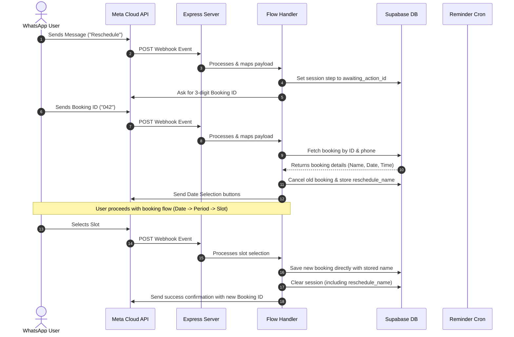

# WhatsApp Appointment Booking Bot — Architecture & Working (v1.1)

An automated conversational agent built with Node.js, Express, the Meta WhatsApp Cloud API, and Supabase (PostgreSQL) for booking appointments, managing user sessions, and sending automatic reminders.

---

## What is it?
This is a production-ready, state-controlled WhatsApp booking assistant (v1.1). Building on v1.0, this version introduces full time-zone synchronization for Indian Standard Time (IST) to ensure correct date and slot rendering on cloud servers (like Render, which defaults to UTC). It also adds support for cancelling and rescheduling bookings using a unique 3-digit Booking ID. The rescheduling flow is optimized to reuse the user's previously provided name instead of asking for it a second time.

---

## System Architecture
The application runs as a webhook-driven server communicating with the Meta WhatsApp Cloud API for message exchange and Supabase for database state management and persistent records.



---

## How it Works & The Full Workflow

The booking assistant uses a database-backed state machine to track each phone number's progress.

### Conversation Funnel & State Transition Workflow

The bot supports booking, cancelling, and rescheduling, transitioning through the following states:

```
[Idle State]
     │
     ├─► (User sends "Book" or greeting)
     │     │
     │     ▼
     │   [awaiting_date] ──► User picks date via buttons (Today or Tomorrow)
     │     │
     │     ▼
     │   [awaiting_period] ──► User selects a period (Morning, Afternoon, or Evening)
     │     │
     │     ▼
     │   [awaiting_slot] ──► User selects a 20-minute slot from a list menu
     │     │
     │     ▼
     │   [awaiting_name] ──► User types name (skipped if reschedule_name is set)
     │     │
     │     ▼
     │   [Resets to Idle] ──► Bot saves booking, sends confirmation, clears session
     │
     ├─► (User sends "Cancel")
     │     │
     │     ▼
     │   [awaiting_action_id] ──► User types 3-digit Booking ID
     │     │
     │     ▼
     │   [awaiting_cancel_confirm] ──► User taps "Confirm Cancel" or "Keep Booking"
     │     │
     │     ▼
     │   [Resets to Idle] ──► Bot cancels booking, releases slot, clears session
     │
     └─► (User sends "Reschedule")
           │
           ▼
         [awaiting_action_id] ──► User types 3-digit Booking ID
           │
           ▼
         (Bot cancels old booking, saves name to reschedule_name, transitions to Date selection)
```

### Detailed Execution Steps & Version 1.1 Improvements

#### 1. Initial State Options
The bot listens for "Book", "Cancel", "Reschedule", or standard greetings like "Hi".
* **Book**: Moves the user to the date selection step.
* **Cancel / Reschedule**: Transitions user to `awaiting_action_id` and prompts for the 3-digit Booking ID.

#### 2. Time-Zone Synchronization (IST Fixes)
To prevent server-local time issues on cloud platforms (e.g., Render using UTC):
* All current dates are calculated using `Date.now() + 330 * 60 * 1000` to shift to Indian Standard Time (IST).
* The date buttons display the correct IST-relative day names and dates (e.g., "Today (20 Jun)" and "Tomorrow (21 Jun)") using UTC method formatting on shifted dates.
* Time checking logic filters out slots that have already passed in IST.

#### 3. Booking Lookup & Verification
In `awaiting_action_id`, the bot validates that the entered string is 1 to 3 digits and pads it to 3 digits (e.g., "42" becomes "042"). It verifies that a confirmed booking exists for that ID and matches the sender's phone number.
* **Cancellation**: Transitions to `awaiting_cancel_confirm` showing buttons to confirm or abort.
* **Rescheduling**: Immediately cancels the original booking to release the slot for other users, copies the booking owner's name into the session (`reschedule_name`), and redirects the user to the date selection flow.

#### 4. Rescheduling Workflow (Name Bypass)
During slot selection, if the session has a value in `reschedule_name`, the bot bypasses the `awaiting_name` state. It immediately creates the booking using the stored name, ensuring the customer does not have to type their name again.

#### 5. Dynamic Slot Filtering Improvements
* The buffer for filtering out past slots is increased to 40 minutes. If today's date is selected, slots starting within 40 minutes of the current time are removed from the options.
* Bookings for today close completely if the current time is past 6:40 PM IST (the start of the final slot).

---

## Automated Background Reminders
A cron process runs every minute to send reminders:
1. **Fetch**: Retrieves confirmed bookings scheduled to start in the next 20 minutes where no reminder has been sent.
2. **Dispatch**: Dispatches a WhatsApp reminder message containing the booking details.
3. **Update**: Sets `reminder_sent = true` in Supabase to guarantee that each booking receives exactly one notification.
