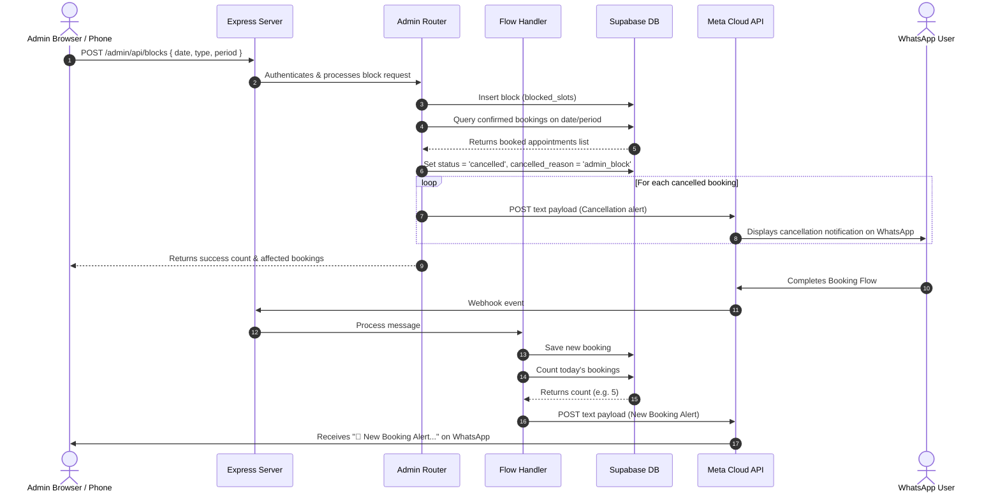

# WhatsApp Appointment Booking Bot — Architecture & Working (v2.0)

An automated conversational agent built with Node.js, Express, the Meta WhatsApp Cloud API, and Supabase (PostgreSQL) for booking appointments, managing user sessions, sending automatic reminders, and administering the system via a web dashboard or WhatsApp shortcut commands.

---

## What is it?
This is a production-ready, state-controlled WhatsApp booking assistant (v2.0). In addition to the core appointment flow and time-zone fixes of previous releases, this version introduces advanced administration capabilities. It includes automated WhatsApp notifications to the admin on new bookings, in-channel schedule commands for administrative phone numbers, a slot blocking system (blocking whole days or specific periods) that automatically cancels conflicting appointments and notifies users, and a secure, minimalist web admin dashboard.

---

## System Architecture
The application runs as a webhook-driven server communicating with the Meta WhatsApp Cloud API for message exchange, Supabase for database state management, and a Cookie-based REST endpoint for the web dashboard.



---

## How it Works & The Full Workflow

The booking assistant uses a database-backed state machine to track each phone number's progress.

### Administrative Integration & Features

#### 1. Real-Time Admin Alerts
When a patient completes the booking process and enters their name:
* The system counts the total number of confirmed appointments for that local IST date.
* The system sends a WhatsApp message to the registered `ADMIN_PHONE` containing:
  * Booking ID (3-digit zero-padded number)
  * Patient's name
  * Patient's phone number (with country code prefix)
  * Date and Time Slot of the booking
  * Running count of total bookings booked for today

#### 2. WhatsApp Schedule Commands
When a text message is received from the number matching `ADMIN_PHONE`:
* If the message is exactly "list" or "schedule", it bypasses the standard booking flow.
* The system queries all confirmed appointments scheduled from the current IST date onward.
* The results are grouped by date, formatted into an ordered schedule text block, and returned to the admin on WhatsApp.
* All other messages from the admin number follow the standard booking/cancellation flow.

#### 3. Date and Period Slot Blocking System
Administrators can block specific time ranges to prevent bookings:
* **Day-Level Block**: Prevents any bookings from being made on a specific date.
* **Period-Level Block**: Prevents bookings during specific intervals ("morning", "afternoon", or "evening") on a selected date.
* When a block is created, all conflicting, confirmed bookings within that date/period are identified:
  * The booking status is changed to `cancelled` and the `cancelled_reason` is updated to `admin_block`.
  * The system automatically generates and dispatches custom cancellation messages to each affected patient's WhatsApp number.
* The slot generator filters out any slot that matches a blocked date or period before displaying options to users.

#### 4. Web Administration Dashboard
The application hosts a secure dashboard at `/admin`.
* **Design Guidelines**: Formatted as a light-themed, minimalist UI containing zero glassmorphism, flat surfaces, clear tabular grids, and no shadow elements.
* **Access Control**: Validates username and password against `.env` variables (`ADMIN_USERNAME` / `ADMIN_PASSWORD`), falling back to checks against the `admin_users` database table if necessary. It uses an HttpOnly `admin_session` cookie valid for 8 hours.
* **Live Statistics**: Displays real-time statistics cards for today's bookings, weekly bookings, and today's cancelled bookings.
* **Booking Registry Table**: Shows all bookings (confirmed and cancelled) with filtering support by date and status.
* **Block Configuration Form**: Allows administrators to choose a date from the next 7 days (including today) and block either the entire day or a specific period.
* **Active Blocks Registry**: Displays a table of all active blocks with quick action delete buttons to release blocks and make slots available again.

---

## Database Configuration
The application requires the following database schema in Supabase.

### 1. `blocked_slots` Table
Tracks blocks created by the admin.
```sql
CREATE TABLE IF NOT EXISTS blocked_slots (
    id          SERIAL PRIMARY KEY,
    block_date  DATE NOT NULL,
    slot_time   TEXT,          -- NULL means the entire day is blocked
    period      TEXT,          -- morning | afternoon | evening | NULL (if full day)
    created_at  TIMESTAMPTZ DEFAULT NOW()
);
CREATE INDEX IF NOT EXISTS idx_blocked_slots_date ON blocked_slots(block_date);
```

### 2. `admin_users` Table
Stores credential fallbacks for dashboard authentication.
```sql
CREATE TABLE IF NOT EXISTS admin_users (
    id          SERIAL PRIMARY KEY,
    username    TEXT UNIQUE NOT NULL,
    password    TEXT NOT NULL,
    created_at  TIMESTAMPTZ DEFAULT NOW()
);
INSERT INTO admin_users (username, password)
VALUES ('Admin_1', 'Admin@01')
ON CONFLICT (username) DO NOTHING;
```

### 3. Required Column Migrations (from v1.x)
Ensure your existing `bookings` and `user_sessions` tables contain the new metadata columns.
```sql
ALTER TABLE bookings ADD COLUMN IF NOT EXISTS cancelled_reason TEXT;
ALTER TABLE user_sessions ADD COLUMN IF NOT EXISTS reschedule_name TEXT;
```

---

## Environment Variables
Ensure these keys are appended to your server `.env` configuration file:

```env
# Admin Configuration
ADMIN_PHONE=919382426273
ADMIN_SESSION_SECRET=bookingadmin_s3cr3t_2026
ADMIN_USERNAME=Admin_1
ADMIN_PASSWORD=Admin@01
```
